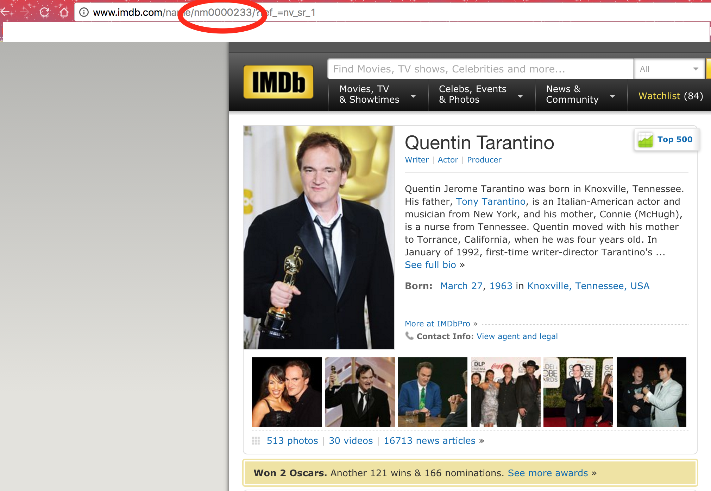

#TopCast: Finding your Favorite Movie Personalities in IMDB Top 250
Have you wondered whether your favorite personality's movie features in **[IMDB Top 250](http://www.imdb.com/chart/top)**. Look no far and use this small python script

## Running the script

The script is simple to run using **[TopCast.py](TopCast.py)** script. the script takes takes the following parametrs: 

|Argument Type			|Meaning										|Example						|Required?		|
|:---------------------:|:----------------------------------------------|:-----------------------------:|:-------------:|
|`[-i/--id]`			|IMDB ID of the personality strting with _nm_	|`-i 'nm0000233'`				|Either/or		|
|`[-n/--name]`			|Name of the personality						|`-n 'Quentin Tarantino'`		|Either/or		|


## Example:

```
python TopCast.py -i 'nm0000233'
```
```
python TopCast.py -n 'Quentin Tarantino' 
```

## ID vs Name

Inputing an ID guarantees you that you'll find the personality you are searching for. With name, the script uses IMDB to search for your personality and may return someone with the same name. It is advised to use the ID instead of name. 

### How to find the ID

The ID can be found by going to **[IMDB](http://www.imdb.com/)** and searching for your favorite personality. The urls for persons are of the format http://www.imdb.com/name/nm####### (Example **http://www.imdb.com/name/nm0000233 **). You are required to copy the **nm#######** part. See example below. 

